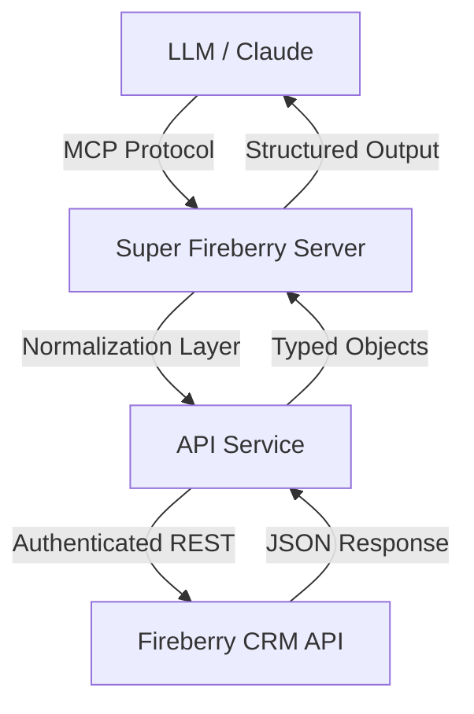

# Super Fireberry MCP

<p align="center">
  
  
</p>

<p align="center">
  <a href="https://github.com/TheOctMind/super-fireberry-mcp/actions"></a>
  <a href="https://opensource.org/licenses/MIT"></a>
  <a href="https://github.com/prettier/prettier"></a>
  <a href="https://www.typescriptlang.org/"></a>
</p>

---

## Overview

Super Fireberry MCP is a production-grade implementation of the Model Context Protocol (MCP) specifically engineered for Fireberry CRM. It provides a high-fidelity interface for Large Language Models (LLMs) to interact with CRM data using natural language.

This server acts as an intelligent middleware, abstracting the complexities of the Fireberry REST API into a set of powerful, self-documenting tools.

## Architecture

The project is built on a modular service-oriented architecture, ensuring high performance and type safety.



### Key Components
- **Normalization Service**: Maps human-readable entity names to internal system codes.
- **Query Engine**: Translates natural language intent into structured Fireberry Query API payloads.
- **Batch Handler**: Manages high-volume data operations with efficient error recovery.

## Features

- **Full Metadata Reflection**: Zero-config support for custom objects and fields.
- **Power Query**: Advanced filtering (logical AND/OR), sorting, and deep pagination.
- **Financial Integration**: Native support for Invoices, Receipts, and Transaction Items.
- **Batch Processing**: High-throughput creation and updates for enterprise data loads.
- **Relationship Intelligence**: Navigate complex record hierarchies effortlessly.

## Toolset

| Tool | Capability | Typical Use Case |
| :--- | :--- | :--- |
| `get_objects` | System Discovery | "What modules are available?" |
| `get_fields` | Schema Inspection | "What are the fields for 'Projects'?" |
| `query` | Advanced Search | "Find all leads from LinkedIn with status 'New'." |
| `manage_record` | Full CRUD | "Update the status of Account #105 to 'Active'." |
| `get_related_records`| Hierarchy Traversal | "Get all tasks linked to this contact." |

## Installation & Setup

### Prerequisites
- Node.js v18.0.0 or higher
- A valid Fireberry API Access Token

### Local Setup
```bash
git clone https://github.com/TheOctMind/super-fireberry-mcp.git
cd super-fireberry-mcp
npm install
npm run build
```

## Integration

### Claude Desktop Configuration
Add the following entry to your `claude_desktop_config.json`:

```json
{
  "mcpServers": {
    "super-fireberry": {
      "command": "node",
      "args": ["/absolute/path/to/super-fireberry-mcp/build/index.js"],
      "env": {
        "FIREBERRY_TOKEN_ID": "YOUR_API_TOKEN"
      }
    }
  }
}
```

## Roadmap

- **v1.1**: Direct file attachment streaming.
- **v1.2**: Webhook integration for real-time notifications.
- **v2.0**: Native support for Fireberry Workflow execution.

## Contributing

We welcome contributions! Please see our [Contributing Guidelines](CONTRIBUTING.md) for more details.

## License

This project is licensed under the MIT License - see the [LICENSE](LICENSE) file for details.

---
<p align="center">
  Built for the Fireberry Ecosystem
</p>
